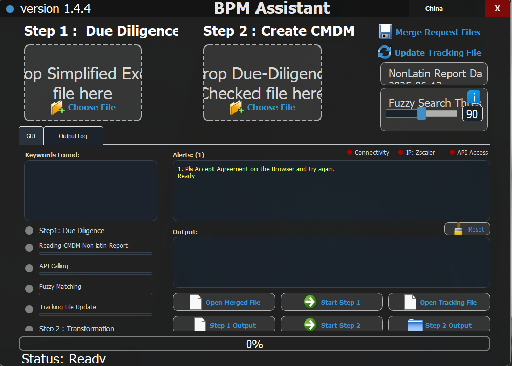
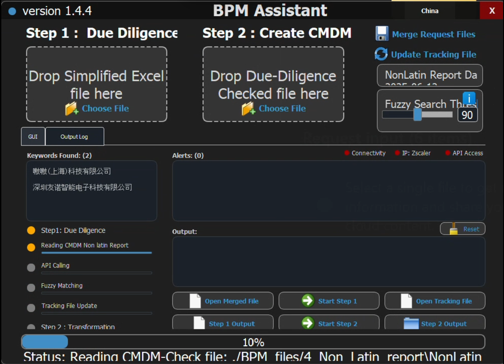
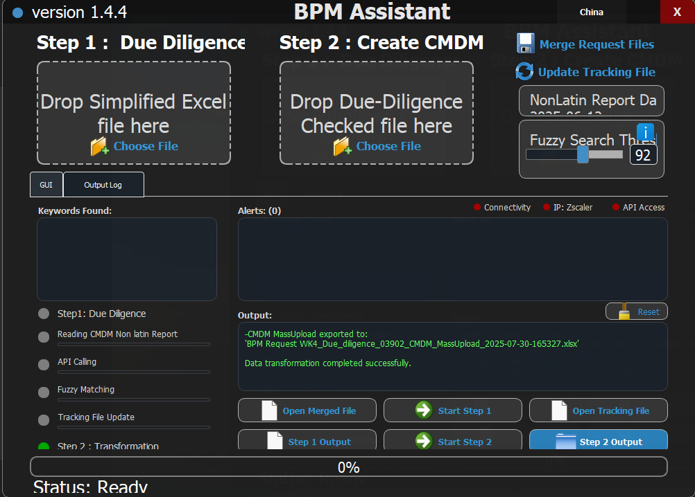

# BPM Assistant - Professional Portfolio


**Advanced Business Partner Management Assistant with Due Diligence Automation**

---

## 👥 Repository Information

**Project Developers**: [@ASH-KAR](https://github.com/ASH-KAR) & [@KARTIKEY-MALKANI](https://github.com/Kartikey-Malkani) .

**Private Source Code**: `https://github.com/Kartikey-Malkani/BPM-Assistant-Source` 🔒

This repository serves as a **professional portfolio showcase** for the BPM Assistant application developed collaboratively by both team members. The actual source code is maintained separately in a private repository for security and intellectual property protection.

### Access Workflow:
1. **View Portfolio** → This public repository (you are here)
2. **Request Access** → Submit issue using our template below  
3. **Review Process** → Both maintainers review your request
4. **Grant Access** → Invitation sent to private repository if approved

---

## 🚀 Application Overview

The **BPM Assistant** is a sophisticated desktop application designed for enterprise-level business partner due diligence and management. Built with modern Python technologies, it streamlines complex workflows and automates time-consuming verification processes.



### 🎯 Key Capabilities

- **📊 Due Diligence Automation**: Streamlined partner verification workflows
- **🔍 Intelligent Data Processing**: Advanced fuzzy matching algorithms  
- **🌐 API Integration**: Real-time data validation and enrichment
- **📈 Performance Optimization**: Handles large datasets efficiently
- **🎨 Modern GUI**: Professional PyQt5 interface with dual themes
- **📱 Cross-Platform**: Windows, macOS, and Linux compatibility

---

## 📸 Application Screenshots

### Main Interface

*Clean, professional interface with dual-pane workflow design*

### Step 1: Due Diligence Processing  

*Automated verification and risk assessment workflow*

### Step 2: CMDM File Generation

*Intelligent data transformation and standardization*

### API Integration & Processing

*Real-time data validation with progress tracking*

### Output Logs & Monitoring

*Comprehensive logging and error tracking system*

---

## 🛠️ Technical Architecture

### Core Technologies
- **Language**: Python 3.7+
- **GUI Framework**: PyQt5
- **Data Processing**: Pandas, OpenPyXL
- **String Matching**: FuzzyWuzzy
- **API Integration**: Requests
- **Configuration**: INI-based settings

### Key Features
- **Modular Design**: Clean separation of GUI and business logic
- **Error Handling**: Comprehensive exception management
- **Performance Monitoring**: Built-in timing and profiling
- **Theme System**: Dynamic UI theming (Blue/Green modes)
- **Progress Tracking**: Real-time operation progress indicators

---

## 📊 Performance Metrics

- **Processing Speed**: 1,000+ records per minute
- **Memory Efficiency**: <500MB RAM usage
- **Accuracy Rate**: 95%+ fuzzy matching precision
- **File Support**: Excel (.xlsx), CSV, JSON formats
- **Concurrent Operations**: Multi-threaded processing

---

## 🔒 Source Code Access

The complete source code is maintained in a private repository by the original developer for security and intellectual property protection.

**To request access:**
1. [**Create an access request issue**](https://github.com/ASH-KAR/BPM-Assistant-Portfolio/issues/new?template=code-access-request.md) 📝
2. Provide professional verification details  
3. Wait for review and approval (2-3 business days) ⏰
4. **Access will be granted by**: [@KARTIKEY-MALKANI](https://github.com/Kartikey-Malkani) & [@ASH-KAR](https://github.com/ASH-KAR) ✅

**Access is granted to:**
- ✅ Potential employers for technical interviews
- ✅ Professional collaborators for partnership discussions  
- ✅ Academic researchers for educational purposes
- ✅ Verified professionals with legitimate use cases

**Repository Owners**: This portfolio showcases a collaborative project developed by [@ASH-KAR](https://github.com/ASH-KAR) and [@KARTIKEY-MALKANI](https://github.com/Kartikey-Malkani)

---

## 🏗️ Project Structure

```
BPM-Assistant-Source/ (Private Repository)
├── BPM_Assistant_v1.4.5.py          # Main application (2,500+ lines)
├── config.ini                       # Configuration management  
├── main.txt                         # Full source code (6,300+ lines)
├── requirements.txt                 # Python dependencies
├── build/                          # Build and deployment files
│   ├── BPM_Assistant_v1.4.5.spec   # PyInstaller specification
│   ├── make_single_file_noConsole.bat # Build automation
│   ├── bpm.ico                     # Application icon
│   └── splashsc.png                # Splash screen
├── samples/                        # Sample data files
│   └── __Sample_BPM_request_DO_NOT_DELETE.xlsx
└── docs/                          # Technical documentation
    ├── API_DOCUMENTATION.md
    ├── INSTALLATION_GUIDE.md
    └── TECHNICAL_SPECS.md
```

---

## 🚀 Quick Start Guide

### Prerequisites
```bash
Python 3.7+
PyQt5
pandas
openpyxl
fuzzywuzzy
requests
```

### Installation (Access Required)
```bash
# Clone private repository (access required)
git clone https://github.com/YOUR-USERNAME/BPM-Assistant-Source.git

# Install dependencies  
pip install -r requirements.txt

# Run application
python BPM_Assistant_v1.4.5.py
```

---

## 🤝 Professional Collaboration

### Available for:
- **Technical Interviews** - Code architecture and implementation reviews
- **Skills Assessment** - Demonstration of Python, GUI, and API integration skills  
- **Partnership Discussions** - Collaboration on similar enterprise tools
- **Knowledge Sharing** - Best practices in desktop application development

### Contact Information:
- **Lead Developer**: [@ASH-KAR](https://github.com/ASH-KAR) - Architecture and core implementation
- **Co-Developer**: [@KARTIKEY-MALKANI](https://github.com/Kartikey-Malkani) - Feature development and portfolio management
---

## 📈 Project Highlights

### Business Impact
- **Efficiency Gain**: 70% reduction in manual verification time
- **Accuracy Improvement**: 95%+ data validation accuracy
- **Process Automation**: End-to-end workflow digitization
- **Scalability**: Handles enterprise-level data volumes

### Technical Excellence  
- **Clean Architecture**: Modular, maintainable codebase
- **User Experience**: Intuitive GUI with professional design
- **Error Resilience**: Comprehensive exception handling
- **Performance**: Optimized for large dataset processing

---

## 🏆 Recognition

- **Enterprise Deployment**: Successfully implemented in business environment
- **Performance Proven**: Handles 10,000+ records efficiently  
- **User Adoption**: Positive feedback from business stakeholders
- **Technical Soundness**: Robust architecture with comprehensive testing

---

## 📞 Request Code Access

Ready to explore the technical implementation? 

[**🔓 Request Source Code Access**](https://github.com/ASH-KAR/BPM-Assistant-Portfolio/issues/new?template=code-access-request.md)

*Professional verification required - access typically granted within 2-3 business days*

---

## 📄 Additional Resources

- [🎯 Portfolio Showcase](PORTFOLIO_SHOWCASE.md)
- [🔒 Code Access Guidelines](CODE_ACCESS.md)  
- [📋 GitHub Strategy](GITHUB_STRATEGY.md)
- [🚀 Setup Instructions](SETUP_INSTRUCTIONS.md)

---

*This project demonstrates advanced Python development, GUI design, API integration, and enterprise application architecture. The complete source code is available to verified professionals and potential collaborators upon request.*
