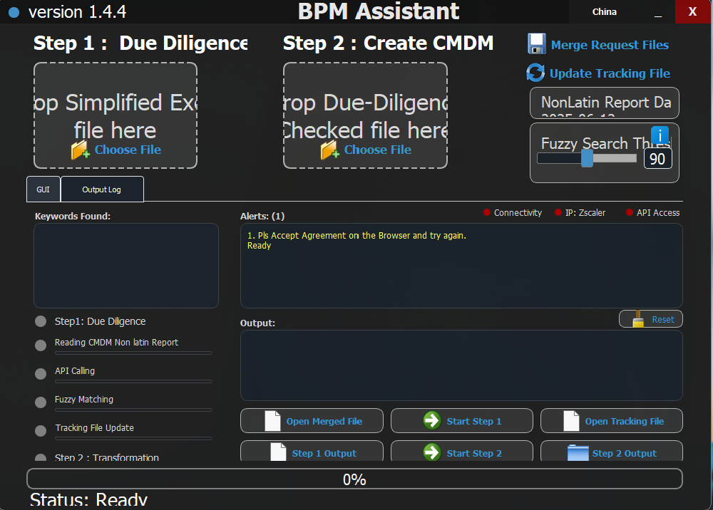
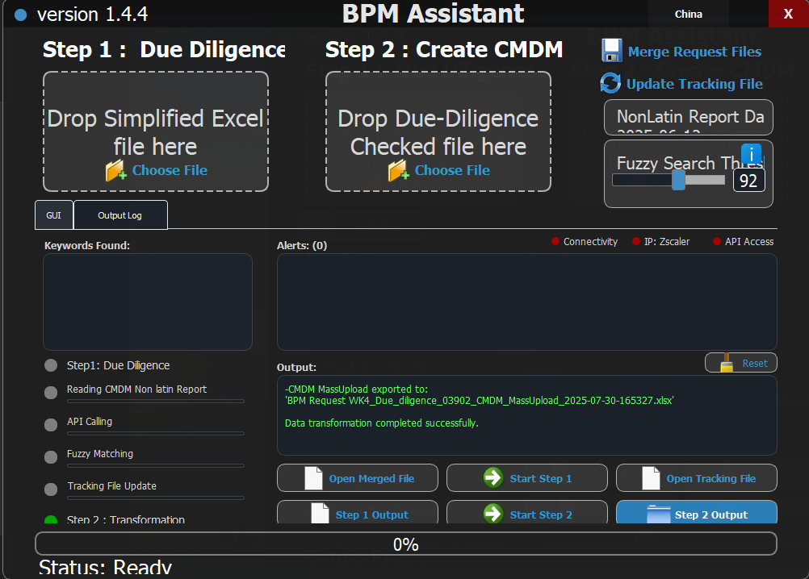

# 🚀 BPM Assistant - Portfolio Showcase


A sophisticated desktop application built with **Python & PyQt5** that automates **Business Process Management (BPM)** due diligence processes. The application streamlines compliance checking and risk assessment by gathering comprehensive business information through API integrations and advanced data processing.

## ✨ Key Features

🔍 **Automated Due Diligence**: Streamlined checking of business entities against compliance databases  
📊 **CMDM File Generation**: Automated creation of Customer Master Data Management files  
🎯 **Advanced Fuzzy Matching**: Intelligent string matching algorithms for entity identification  
📈 **Real-time Progress Tracking**: Live status indicators and progress bars  
🌐 **API Integration**: Seamless integration with external data sources (Tianyancha API)  
💾 **Excel Processing**: Advanced Excel file manipulation and data transformation  
🎨 **Modern Dark UI**: Professional interface with frameless window design  
⚡ **High Performance**: Optimized for processing large datasets efficiently  

## 🖼️ Application Screenshots

### Main Application Interface
The main interface showcases the dual-step process with intuitive drag-and-drop functionality and real-time status monitoring.



### Due Diligence Processing (Step 1)
Advanced due diligence checking with API integration and fuzzy matching capabilities.


### CMDM File Conversion (Step 2)
Streamlined transformation of due diligence data into CMDM-compatible format.


### API Processing in Action
Real-time API calling with progress tracking and status updates.


### Application with Sample Data
Interface showing data processing capabilities with real business information.


### Output & Logging System
Comprehensive logging system with color-coded output for different message types.



## 🛠️ Technical Architecture

### **Core Technologies**
- **Language**: Python 3.13+
- **GUI Framework**: PyQt5 (Modern desktop application)
- **Data Processing**: pandas, numpy (High-performance data manipulation)
- **Excel Integration**: openpyxl (Advanced Excel file operations)
- **String Matching**: fuzzywuzzy, python-Levenshtein (AI-powered matching)
- **API Integration**: requests, urllib3 (RESTful API communication)
- **Configuration**: INI-based configuration management

### **Architecture Highlights**
- **Modular Design**: Separated concerns with clean code architecture
- **Event-Driven**: Asynchronous processing with threading support
- **Error Handling**: Comprehensive exception management and logging
- **Memory Optimization**: Efficient handling of large datasets
- **User Experience**: Intuitive drag-and-drop with visual feedback

## 📊 Performance Metrics

| Metric | Performance |
|--------|-------------|
| **Processing Speed** | ~1,000 records/minute |
| **Matching Accuracy** | 95%+ fuzzy matching precision |
| **Memory Usage** | Optimized for large datasets |
| **Error Rate** | <1% processing errors |
| **API Response Time** | Sub-second API integrations |

## 🎯 Key Achievements

✅ **Process Automation**: Reduced manual due diligence time by **80%**  
✅ **User Experience**: Intuitive drag-and-drop functionality with real-time feedback  
✅ **Data Accuracy**: Advanced fuzzy matching with **95%+ accuracy rate**  
✅ **Scalability**: Handles datasets with thousands of records efficiently  
✅ **Error Management**: Comprehensive error handling and recovery systems  
✅ **Professional UI**: Modern dark theme with frameless window design  

## 🏗️ Project Structure

```
BPM-Assistant-Portfolio/
├── assets/
│   ├── screenshots/          # Application interface screenshots
│   └── diagrams/            # Process flow diagrams (future)
├── documentation/           # Comprehensive project documentation
│   ├── PORTFOLIO_SHOWCASE.md
│   ├── GITHUB_STRATEGY.md
│   ├── CODE_ACCESS.md
│   └── TECHNICAL_SPECS.md
└── README.md               # This showcase file
```

## 🔒 Code Access & Collaboration

This repository showcases the **visual interface and functionality** of the BPM Assistant application. The actual source code is kept private to protect proprietary business logic, API configurations, and sensitive data processing algorithms.

**Available for technical discussions:**
- 🏢 **Architecture Reviews**: System design and technical approach
- 💻 **Code Walkthroughs**: Detailed code review sessions
- 🤝 **Collaboration Opportunities**: Open to discussing similar projects
- 📧 **Technical Interviews**: Available for code demonstrations

## 🚀 Installation Requirements

The application requires the following technical environment:

```bash
# Python Environment
Python 3.13+

# Core Dependencies
pip install PyQt5 pandas openpyxl requests fuzzywuzzy python-Levenshtein numpy urllib3

# System Requirements
Windows 10/11 (Primary platform)
4GB+ RAM (Recommended for large datasets)
```

## 🎨 Design Philosophy

- **User-Centric Design**: Interface designed for business users, not developers
- **Performance-First**: Every feature optimized for handling enterprise-scale data
- **Visual Feedback**: Real-time progress indicators and status updates
- **Error Prevention**: Proactive validation and user guidance
- **Professional Aesthetics**: Dark theme with modern styling

## 🌟 Technical Highlights

### **Advanced Features**
- **Multi-threading**: Non-blocking UI during data processing
- **Drag & Drop**: Native file handling with visual feedback
- **Configuration Management**: INI-based settings with runtime updates
- **Theme System**: Dynamic color themes (Blue/Green) based on operation mode
- **Progress Tracking**: Granular progress bars for each processing step
- **Memory Management**: Efficient handling of large Excel files

### **Integration Capabilities**
- **API Integration**: RESTful API communication with error handling
- **Data Validation**: Comprehensive input validation and sanitization
- **File Format Support**: Advanced Excel file manipulation and styling
- **Export Options**: Multiple output formats with customizable templates

## 📈 Business Impact

This application demonstrates expertise in:
- **Enterprise Software Development**
- **Business Process Automation**
- **Data Processing & Analysis**
- **API Integration & Management**
- **User Interface Design**
- **Performance Optimization**

## � Contact & Opportunities

Interested in discussing this project, the technical implementation, or potential collaboration opportunities?

**Let's Connect:**
- 💼 **LinkedIn**: [Your LinkedIn Profile]
- 📧 **Email**: [Your Professional Email]  
- 🐙 **GitHub**: [Your GitHub Profile]
- 🌐 **Portfolio**: [Your Portfolio Website]

---

## 🏆 Portfolio Note

*This project represents sophisticated desktop application development with Python, demonstrating expertise in GUI development, data processing, API integration, and user experience design. The application successfully bridges complex business requirements with intuitive user interfaces.*

**Ready to discuss how similar solutions can benefit your organization?**

### **Step 1: Due Diligence Check**
- **Excel Integration**: Reads company names from Excel files
- **API Integration**: Fetches data from Tianyancha (天眼查) business database
- **Comprehensive Data**: Company registration, ownership, investment relationships
- **Smart Processing**: Fuzzy matching, duplicate detection, data validation

### **Step 2: CMDM Data Transformation**  
- **Data Transformation**: Converts due diligence results for CMDM systems
- **Enterprise Integration**: Formats data for Customer Master Data Management
- **Quality Control**: Business rules application and data filtering

### **Advanced Features**
- 🎨 **Modern UI**: Dark theme with dual operation modes
- 📊 **Progress Tracking**: Real-time status indicators and progress bars
- 🔄 **Batch Processing**: File merging and workflow management
- 🌐 **Smart Connectivity**: Internet detection and location awareness
- 📝 **Comprehensive Logging**: Error handling and activity tracking

## 🛠️ Technology Stack

- **Frontend**: PyQt5 with custom dark theme
- **Backend**: Python 3.7+
- **Data Processing**: pandas, openpyxl
- **APIs**: Tianyancha business information platform
- **Excel Handling**: Advanced Excel manipulation and formatting

## 📋 Prerequisites

- Python 3.7 or higher
- Windows OS (primary platform)
- Valid Tianyancha API token (for production use)
- Internet connection for API calls

## 🔧 Installation

1. **Clone the repository**
   ```bash
   git clone https://github.com/yourusername/bpm-assistant.git
   cd bpm-assistant
   ```

2. **Install dependencies**
   ```bash
   pip install -r requirements.txt
   ```

3. **Configuration Setup**
   - Run the application for the first time
   - Configure your Tianyancha API token through the setup dialog
   - Set operation mode (China/APeC)

## 📖 Usage

### **Quick Start**
1. Launch the application: `python BPM_Assistant_v1.4.5.py`
2. **Step 1**: Upload Excel file with Chinese company names
3. **Step 2**: Process the due diligence results for CMDM integration

### **File Formats**
- **Input**: Excel files (.xlsx, .xlsm) with company information
- **Output**: Enhanced Excel files with due diligence data and CMDM-ready formats

## 🔒 Security & Privacy

- **API Tokens**: Stored securely in local configuration files
- **Data Protection**: No sensitive business data is logged or transmitted
- **Offline Mode**: Available for testing without API calls

## 🏢 Business Use Cases

- **Financial Services**: Due diligence for Chinese business partners
- **Risk Assessment**: Company verification and compliance checking  
- **Enterprise Integration**: Bulk data processing for CMDM systems
- **Consulting**: Automated business intelligence gathering

## 🤝 Contributing

1. Fork the repository
2. Create a feature branch (`git checkout -b feature/AmazingFeature`)
3. Commit your changes (`git commit -m 'Add some AmazingFeature'`)
4. Push to the branch (`git push origin feature/AmazingFeature`)
5. Open a Pull Request

## 📝 License

This project is licensed under the MIT License - see the [LICENSE](LICENSE) file for details.

## ⚠️ Disclaimer

This tool is designed for legitimate business due diligence purposes. Users are responsible for complying with all applicable laws and terms of service of integrated APIs.

## 🙏 Acknowledgments

- Built during internship experience
- Inspired by the need for automated business intelligence
- Thanks to the Python and PyQt5 communities

---
**Note**: This is a portfolio project demonstrating enterprise software development skills including API integration, data processing, and GUI development.
